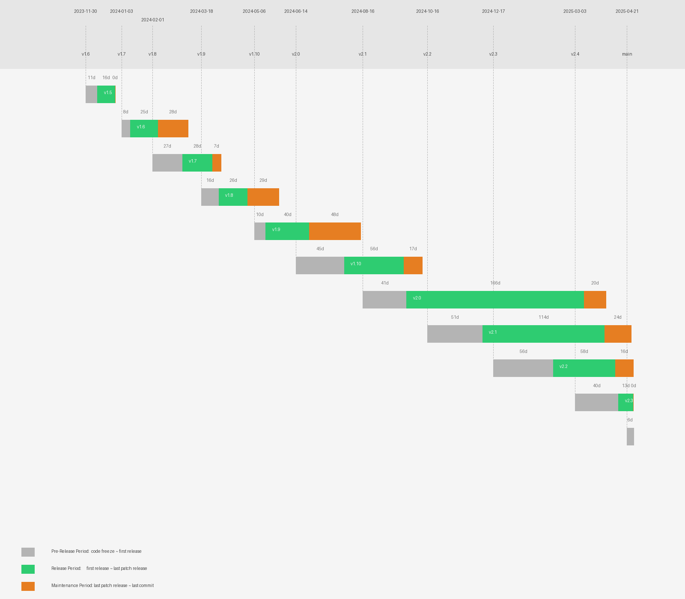

# RisingWave Release Timeline

## Release Details

| Version | Branch Created | First Release | Last Release | Last Commit |
| :------ | :------------- | :------------ | :----------- | :---------- |
| v1.5 | Nov 30, 2023 | **v1.5.0** (Dec 11, 2023) | **v1.5.4** (Dec 28, 2023) | Dec 28, 2023 |
| v1.6 | Jan 03, 2024 | **v1.6.0** (Jan 11, 2024) | **v1.6.1** (Feb 06, 2024) | Mar 05, 2024 |
| v1.7 | Feb 01, 2024 | **v1.7.0** (Feb 29, 2024) | **v1.7.3** (Mar 28, 2024) | Apr 05, 2024 |
| v1.8 | Mar 18, 2024 | **v1.8.0** (Apr 03, 2024) | **v1.8.2** (Apr 30, 2024) | May 29, 2024 |
| v1.9 | May 06, 2024 | **v1.9.0** (May 17, 2024) | **v1.9.2** (Jun 27, 2024) | Aug 14, 2024 |
| v1.10 | Jun 14, 2024 | **v1.10.0** (Jul 30, 2024) | **v1.10.2** (Sep 24, 2024) | Oct 11, 2024 |
| v2.0 | Aug 16, 2024 | **v2.0.1** (Sep 26, 2024) | **v2.0.7** (Mar 12, 2025) | Apr 01, 2025 |
| v2.1 | Oct 16, 2024 | **v2.1.0** (Dec 06, 2024) | **v2.1.5** (Mar 31, 2025) | May 01, 2025 |
| v2.2 | Dec 17, 2024 | **v2.2.0** (Feb 11, 2025) | **v2.2.6** (Apr 28, 2025) | May 01, 2025 |
| v2.3 | Mar 03, 2025 | **v2.3.0** (Apr 13, 2025) | **v2.3.1** (Apr 27, 2025) | May 01, 2025 |
| v2.4 | Apr 21, 2025 | N/A | N/A | Apr 29, 2025 |

*Generated on May 02, 2025*
