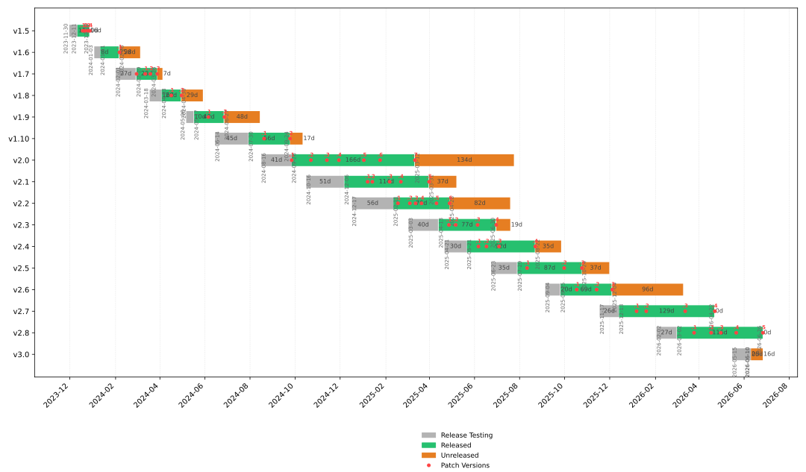

# RisingWave Release Timeline

## Details
| Version | Branch creation | RC releases | Formal releases | Last commit |
| :------ | :-------------- | :---------- | :-------------- | :---------- |
| v2.8 | 2026-02-02 | 2026-02-06 (v2.8.0-rc.1) | 2026-03-02 (v2.8.0) 2026-03-25 (v2.8.1) 2026-04-17 (v2.8.2) | 2026-04-27 |
| v2.7 | 2025-11-17 | 2025-12-01 (v2.7.0-rc.1) | 2025-12-13 (v2.7.0) 2026-01-06 (v2.7.1) 2026-01-19 (v2.7.2) 2026-03-13 (v2.7.3) 2026-04-22 (v2.7.4) | 2026-04-22 |
| v2.6 | 2025-09-04 | 2025-09-09 (v2.6.0-rc.1) | 2025-09-25 (v2.6.0) 2025-10-17 (v2.6.1) 2025-11-13 (v2.6.2) 2025-12-04 (v2.6.3) | 2026-03-11 |
| v2.5 | 2025-06-23 | 2025-07-16 (v2.5.0-rc.1) | 2025-07-29 (v2.5.0) 2025-08-11 (v2.5.1) 2025-09-30 (v2.5.2) 2025-10-24 (v2.5.3) | 2025-12-01 |
| v2.4 | 2025-04-21 | 2025-05-07 (v2.4.0-rc.1) | 2025-05-21 (v2.4.0) 2025-06-06 (v2.4.1) 2025-06-17 (v2.4.2) 2025-07-04 (v2.4.3) 2025-08-22 (v2.4.4) | 2025-09-26 |
| v2.3 | 2025-03-03 |  |  | 2025-07-19 |
| v2.2 | 2024-12-17 | 2025-01-25 (v2.2.0-rc.1) | 2025-02-11 (v2.2.0) 2025-02-17 (v2.2.1) 2025-03-05 (v2.2.2) 2025-03-13 (v2.2.3) 2025-03-21 (v2.2.4) 2025-04-10 (v2.2.5) 2025-04-28 (v2.2.6) | 2025-07-19 |
| v2.1 | 2024-10-16 |  |  | 2025-05-08 |
| v2.0 | 2024-08-16 |  |  | 2025-07-24 |
| v1.10 | 2024-06-14 |  |  | 2024-10-11 |
| v1.9 | 2024-05-06 | 2024-05-21 (v1.9.1-rc.1) 2024-05-28 (v1.9.1-rc.2) | 2024-05-17 (v1.9.0) 2024-06-05 (v1.9.1) 2024-06-27 (v1.9.2) | 2024-08-14 |
| v1.8 | 2024-03-18 |  |  | 2024-05-29 |
| v1.7 | 2024-02-01 |  |  | 2024-04-05 |
| v1.6 | 2024-01-03 |  |  | 2024-03-05 |
| v1.5 | 2023-11-30 |  |  | 2023-12-28 |

*Generated 2026-04-27*