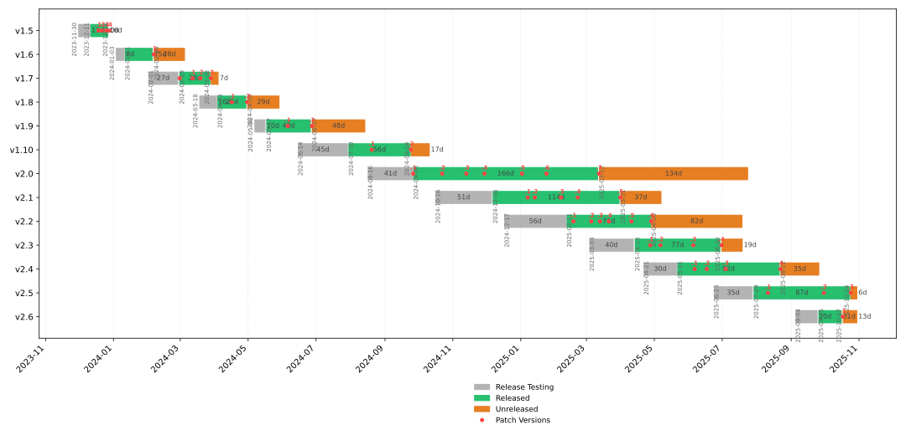

# RisingWave Release Timeline

## Details
| Version | Branch creation | RC releases | First release | Last release | Last commit |
| :------ | :-------------- | :---------- | :------------ | :----------- | :---------- |
| v1.5 | 2023-11-30 |  | 2023-12-11 | 2023-12-28 (v1.5.4) | 2023-12-28 |
| v1.6 | 2024-01-03 |  | 2024-01-11 | 2024-02-06 (v1.6.1) | 2024-03-05 |
| v1.7 | 2024-02-01 |  | 2024-02-29 | 2024-03-28 (v1.7.3) | 2024-04-05 |
| v1.8 | 2024-03-18 |  | 2024-04-03 | 2024-04-30 (v1.8.2) | 2024-05-29 |
| v1.9 | 2024-05-06 | 2024-05-21 (v1.9.1-rc.1) 2024-05-28 (v1.9.1-rc.2) | 2024-05-17 | 2024-06-27 (v1.9.2) | 2024-08-14 |
| v1.10 | 2024-06-14 | 2024-07-01 (v1.10.0-rc.1) 2024-07-16 (v1.10.0-rc.2) 2024-07-18 (v1.10.0-rc.3) | 2024-07-30 | 2024-09-24 (v1.10.2) | 2024-10-11 |
| v2.0 | 2024-08-16 | 2024-09-04 (v2.0.0-rc.1) | 2024-09-26 | 2025-03-12 (v2.0.7) | 2025-04-01 |
| v2.1 | 2024-10-16 | 2024-10-30 (v2.1.0-rc.1) 2024-11-08 (v2.1.0-rc.2) | 2024-12-06 | 2025-03-31 (v2.1.5) | 2025-05-01 |
| v2.2 | 2024-12-17 | 2025-01-25 (v2.2.0-rc.1) | 2025-02-11 | 2025-04-28 (v2.2.6) | 2025-05-06 |
| v2.3 | 2025-03-03 | 2025-03-26 (v2.3.0-rc.1) | 2025-04-13 | 2025-05-06 (v2.3.2) | 2025-05-07 |
| v2.4 | 2025-04-21 | 2025-05-07 (v2.4.0-rc.1) | — | — | 2025-05-07 |

*Generated 2025-05-07*